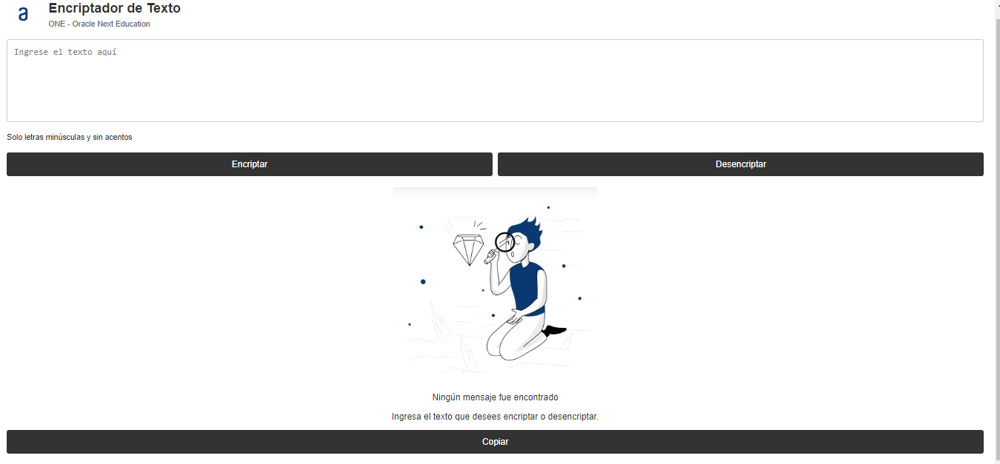
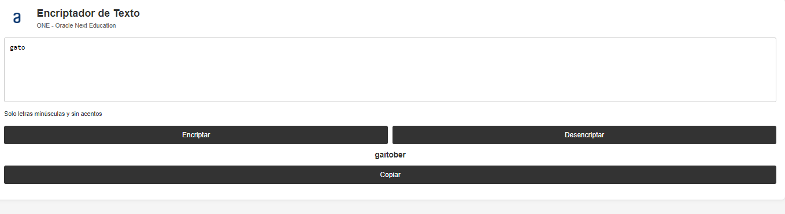
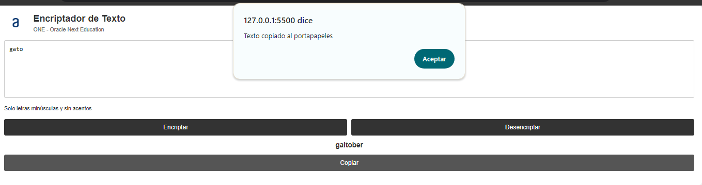
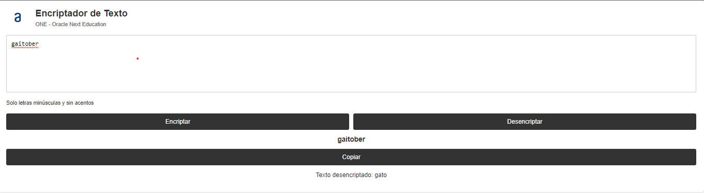

# Aplicación de Encriptación de Textos

**Impulsado por:** ONE - Oracle Next Education

**Desarrollado por:** Abraham Estrada

## Resumen

Este proyecto consiste en una aplicación web diseñada para encriptar y desencriptar mensajes mediante un método de sustitución de letras. Es perfecto para enviar mensajes confidenciales a otras personas que conocen el método de encriptación.

## Claves de Encriptación

Las siguientes reglas de sustitución se aplican a las letras:

- **e** se transforma en **enter**
- **i** se transforma en **imes**
- **a** se transforma en **ai**
- **o** se transforma en **ober**
- **u** se transforma en **ufat**

## Requerimientos

- La aplicación debe operar únicamente con letras minúsculas.
- No se deben utilizar letras acentuadas ni caracteres especiales.
- Debe permitir tanto la conversión de una palabra a su versión encriptada como la conversión inversa de una palabra encriptada a su forma original.

### Ejemplo de Uso

- **Texto de Entrada:** `gato`
- **Texto Encriptado:** `gaitober`
- **Texto Desencriptado:** `gaitober` => `gato`

## Funcionalidades

- Campo de texto para ingresar el mensaje que será encriptado o desencriptado.
- Opciones para encriptar o desencriptar el texto ingresado.
- Visualización del resultado directamente en la pantalla.
- Botón que permite copiar el texto encriptado/desencriptado al portapapeles.

## Ejecución
 - Inicio del proyecto y como se presenta al usuario:
 
 - La colocación de una palabra dentro del cuadro de texto, se presionará **encriptar** y saldrá la palabra encriptada.

- Se visualiza la habilitación y operatividad del botón **copiar** y solo aplicar el pegado dentro del cuadro de texto.
 
 - Se ejecutará la **desencriptación** devolviendo como resultado la palabra original.
  

## Tecnologías Utilizadas

- HTML5
- CSS
- JavaScript
